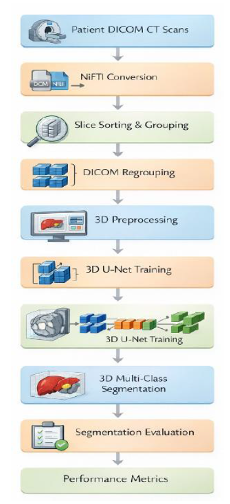
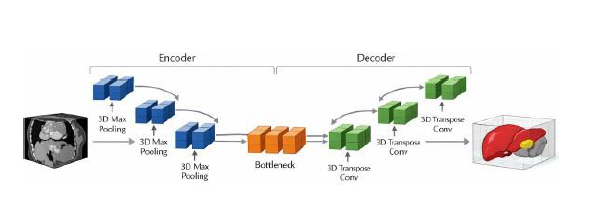
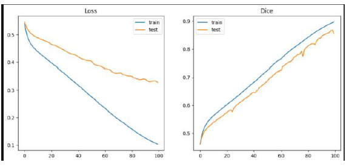
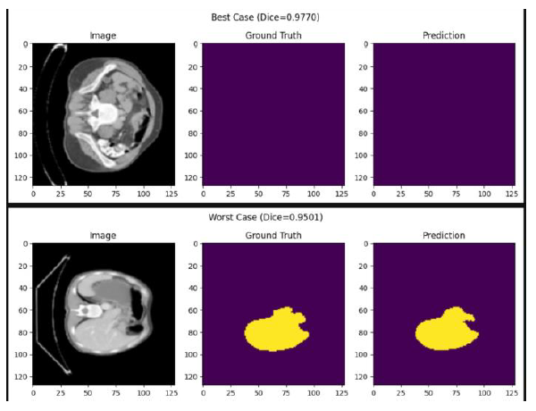
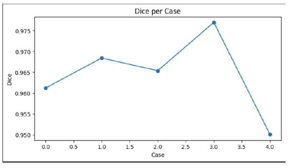

# 🩺 Liver & Tumor Segmentation using MONAI

An AI-powered medical imaging project that automatically detects and segments the **liver** and **liver tumors** from CT scan images using a **3D U-Net** model built with **MONAI** and **PyTorch**.

---

## 🚀 Features

- Automatic liver segmentation
- Automatic liver tumor detection
- 3D U-Net architecture
- Built with MONAI and PyTorch
- Medical image preprocessing
- Dice Score evaluation

---

## 🛠️ Technologies Used

- Python
- PyTorch
- MONAI
- NumPy
- Matplotlib
- Nibabel
- Jupyter Notebook

---

## 📂 Dataset

**LiTS (Liver Tumor Segmentation Challenge)**

> The dataset is not included in this repository because of its large size.

---

## 📸 Project Workflow

### Workflow



### Model Architecture



### Training Performance



### Segmentation Results



### Dice Score



---

## 📊 Results

- Mean Dice Score: **0.9644**
- Accurate liver and tumor segmentation
- Stable training and validation performance

---

## ▶️ How to Run

Clone the repository:

```bash
git clone https://github.com/subhArthi2004/Liver-Tumor-Segmentation-MONAI.git
```

Go to the project folder:

```bash
cd Liver-Tumor-Segmentation-MONAI
```

Install the required packages:

```bash
pip install -r requirements.txt
```

Launch Jupyter Notebook:

```bash
jupyter notebook
```

Open:

```text
Liver_Tumor_Segmentation.ipynb
```

Run all the cells.

---

## 📄 Research Paper

The complete research paper explaining the methodology, model architecture, experiments, and results is included in this repository.

**Research_Paper.pdf**

---

## 👨‍💻 Author

**Subharthi Chowdhuri**

AI | Machine Learning | Computer Vision

If you found this project useful, consider giving it a ⭐.
